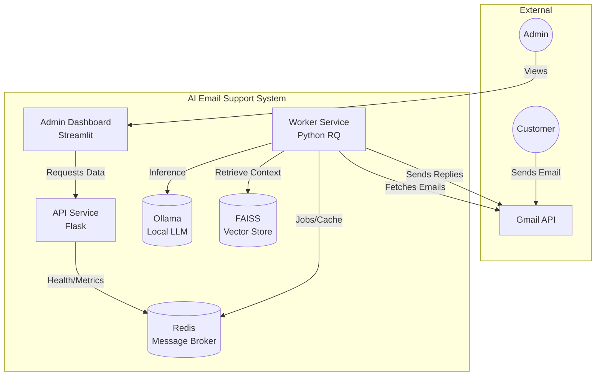
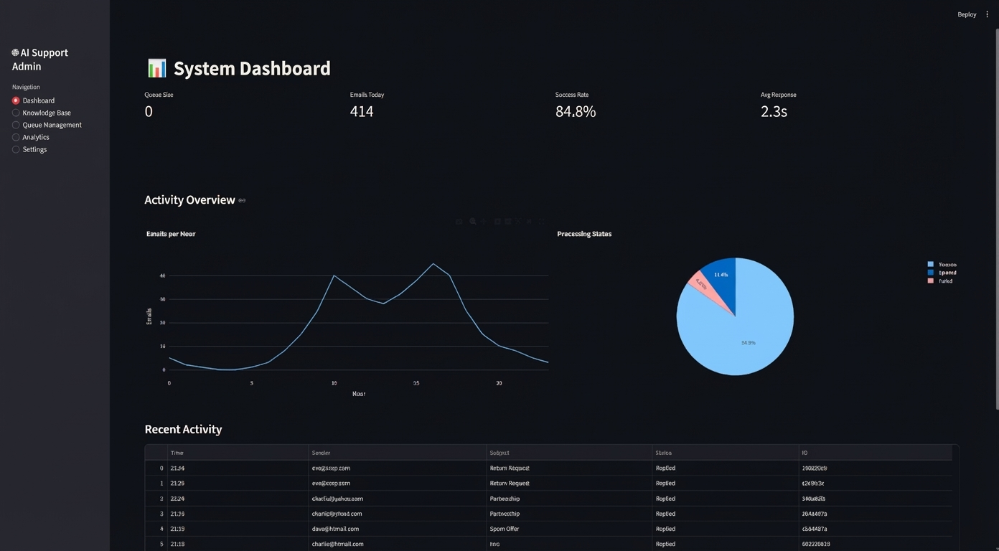

# 🤖 AI Email Support System

[](https://github.com/ArtemRivnyi/ai-email-support-clothing-store/actions/workflows/ci-cd.yml)


**An enterprise-grade, privacy-first AI email automation platform designed for e-commerce.**

This system autonomously processes incoming customer support emails, classifies them using local LLMs (Ollama), retrieves relevant policies via RAG (Retrieval-Augmented Generation), and drafts professional responses—all without data leaving your infrastructure.

---

## 📑 Table of Contents
- [Features](#-features)
- [Architecture](#-architecture)
- [Dashboard Preview](#-dashboard-preview)
- [Quick Start](#-quick-start)
- [Project Structure](#-project-structure)
- [Documentation](#-documentation)
- [License](#-license)
- [Maintainer](#-maintainer)

---

## ✨ Features

*   **🚀 Microservices Architecture**: Decoupled services (API, Worker, Dashboard) containerized with Docker.
*   **🧠 Privacy-First AI**: Uses **Ollama** running locally (Gemma:7b) for classification and generation. No data sent to external AI providers.
*   **📚 RAG Engine**: Retrieval-Augmented Generation using **FAISS** vector search to answer questions based on your specific knowledge base.
*   **⚡ Asynchronous Processing**: **Redis Queue (RQ)** handles high volumes of emails without blocking.
*   **🛡️ Enterprise Security**: OAuth2 Gmail integration, Rate limiting, and Secure secrets management.
*   **📊 Observability**: Prometheus metrics, Grafana dashboards, and Streamlit admin interface.
*   **☸️ Cloud-Ready**: Includes full **Kubernetes** manifests for deployment.

---

## 🏗 Architecture

The system uses a clean microservices pattern. The **Worker** handles the heavy lifting (AI processing) asynchronously, while the **API** serves the **Dashboard** and external integrations.



---

## 📸 Dashboard Preview



*Real-time monitoring of email processing, queue status, and system health.*

---

## 🚀 Quick Start

### Prerequisites
*   Docker & Docker Compose
*   Git

### 1. Clone the Repository
```bash
git clone https://github.com/ArtemRivnyi/ai-email-support-clothing-store.git
cd ai-email-support-clothing-store
```

### 2. Configure Environment
Create a `.env` file (or use the provided `docker-compose.production.yml` defaults):
```bash
cp .env.example .env
# Edit .env with your Gmail credentials
```

### 3. Run with Docker Compose
```bash
docker-compose -f docker-compose.production.yml up --build -d
```

The system will start the following services:
*   **API**: `http://localhost:5000`
*   **Dashboard**: `http://localhost:8501`
*   **Ollama**: `http://localhost:11434`
*   **Redis**: `localhost:6379`

---


## 📧 Gmail Setup

Before running the system, you need to configure Gmail API access.

**Detailed setup guide**: [docs/GMAIL_SETUP.md](docs/GMAIL_SETUP.md)

**Quick start**:
1. Create Google Cloud project
2. Enable Gmail API
3. Download `credentials.json`
4. Run `python scripts/generate_token.py`

---

## 📂 Project Structure

```
├── api/                # Flask API service
├── config/             # Configuration & Secrets management
├── dashboard/          # Streamlit Admin Dashboard
├── docs/               # Documentation (Architecture, Runbooks)
├── embeddings/         # FAISS vector store & Knowledge Base
├── k8s/                # Kubernetes manifests
├── services/           # Core business logic (LLM, RAG, Gmail)
├── tests/              # Unit & Integration tests
├── worker.py           # Background task worker
└── docker-compose.production.yml
```

---

## 📚 Documentation

*   [Value Proposition & ROI](docs/VALUE_PROPOSITION.md)
*   [Operational Runbook](docs/RUNBOOK.md)
*   [Production Checklist](docs/PRODUCTION_CHECKLIST.md)
*   [Demo Script](docs/DEMO_SCRIPT.md)

---

## 📄 License

This project is licensed under the MIT License - see the [LICENSE](LICENSE) file for details.

---

## 🧰 Maintainer

**Artem Rivnyi** — Junior Technical Support / DevOps Enthusiast

- 📧 [artemrivnyi@outlook.com](mailto:artemrivnyi@outlook.com)
- 🔗 [LinkedIn](https://www.linkedin.com/in/artem-rivnyi/)
- 🌐 [Personal Projects](https://github.com/ArtemRivnyi?tab=repositories)
- 💻 [GitHub](https://github.com/ArtemRivnyi)
