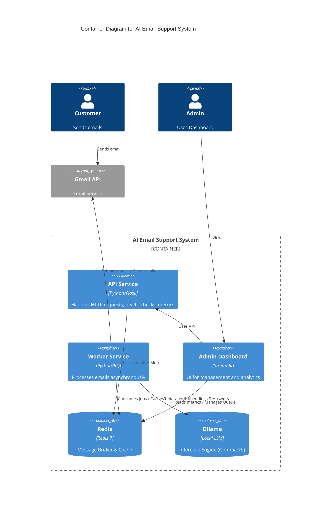

```mermaid
C4Container
    title Container Diagram for AI Email Support System

    Person(customer, "Customer", "Sends emails")
    Person(admin, "Admin", "Uses Dashboard")

    System_Ext(gmail, "Gmail API", "Email Service")

    Container_Boundary(c1, "AI Email Support System") {
        Container(api, "API Service", "Python/Flask", "Handles HTTP requests, health checks, metrics")
        Container(worker, "Worker Service", "Python/RQ", "Processes emails asynchronously")
        Container(dashboard, "Admin Dashboard", "Streamlit", "UI for management and analytics")
        ContainerDb(redis, "Redis", "Redis 7", "Message Broker & Cache")
        ContainerDb(ollama, "Ollama", "Local LLM", "Inference Engine (Gemma:7b)")
    }

    Rel(customer, gmail, "Sends email")
    Rel(worker, gmail, "Fetches emails / Sends replies")
    
    Rel(worker, redis, "Consumes jobs / Caches data")
    Rel(api, redis, "Checks health / Metrics")
    Rel(dashboard, redis, "Reads metrics / Manages Queue")
    
    Rel(worker, ollama, "Generates Embeddings & Answers")
    Rel(dashboard, api, "Uses API")
    
    Rel(admin, dashboard, "Views")
```
