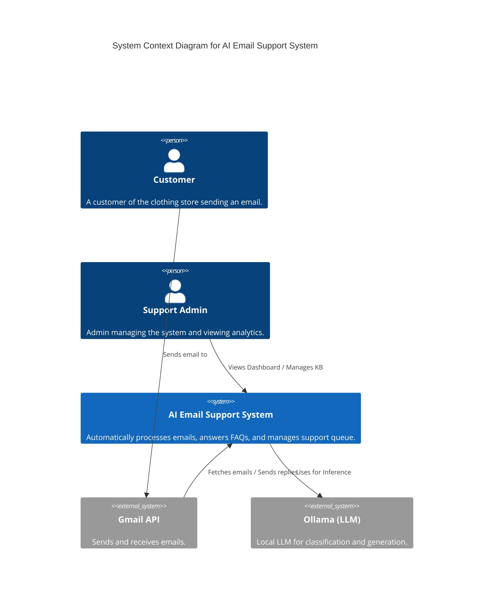

```mermaid
C4Context
    title System Context Diagram for AI Email Support System

    Person(customer, "Customer", "A customer of the clothing store sending an email.")
    Person(admin, "Support Admin", "Admin managing the system and viewing analytics.")

    System(email_system, "AI Email Support System", "Automatically processes emails, answers FAQs, and manages support queue.")

    System_Ext(gmail, "Gmail API", "Sends and receives emails.")
    System_Ext(ollama, "Ollama (LLM)", "Local LLM for classification and generation.")

    Rel(customer, gmail, "Sends email to")
    Rel(gmail, email_system, "Fetches emails / Sends replies")
    Rel(email_system, ollama, "Uses for Inference")
    Rel(admin, email_system, "Views Dashboard / Manages KB")
```
