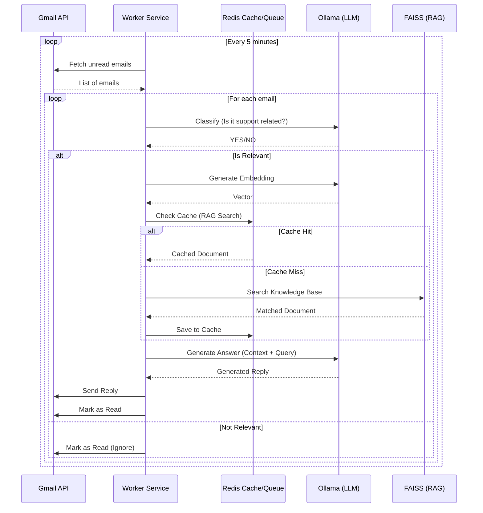

```mermaid
sequenceDiagram
    participant Gmail as Gmail API
    participant Worker as Worker Service
    participant Redis as Redis Cache/Queue
    participant Ollama as Ollama (LLM)
    participant FAISS as FAISS (RAG)

    loop Every 5 minutes
        Worker->>Gmail: Fetch unread emails
        Gmail-->>Worker: List of emails
        
        loop For each email
            Worker->>Ollama: Classify (Is it support related?)
            Ollama-->>Worker: YES/NO
            
            alt Is Relevant
                Worker->>Ollama: Generate Embedding
                Ollama-->>Worker: Vector
                
                Worker->>Redis: Check Cache (RAG Search)
                alt Cache Hit
                    Redis-->>Worker: Cached Document
                else Cache Miss
                    Worker->>FAISS: Search Knowledge Base
                    FAISS-->>Worker: Matched Document
                    Worker->>Redis: Save to Cache
                end
                
                Worker->>Ollama: Generate Answer (Context + Query)
                Ollama-->>Worker: Generated Reply
                
                Worker->>Gmail: Send Reply
                Worker->>Gmail: Mark as Read
            else Not Relevant
                Worker->>Gmail: Mark as Read (Ignore)
            end
        end
    end
```
